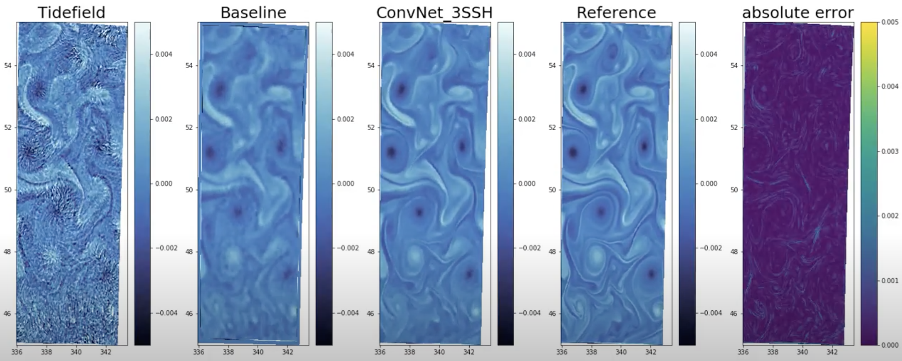

# DetideNet

In construction: code for the "Filtering Internal tides from wide-swath altimeter data using Convolutional Neural Networks" paper, accepted for publication in IEEE IGARSS 2020 conference https://ieeexplore.ieee.org/document/9323531.

This repository contains an example code of training DetideNet, the Summer/Winter data used for training can be accessed here (2,4 Go each) https://drive.google.com/drive/folders/1Uwt7ocD34V-uqE7yzelJsJ1-XcD8XSjc?usp=sharing, please cite the conference paper. 

I am working on a extended version of the IGARSS paper, new architectures and optimal versions of the code will be shared when I find some time... In the meanwhile you can watch some animations I made:

